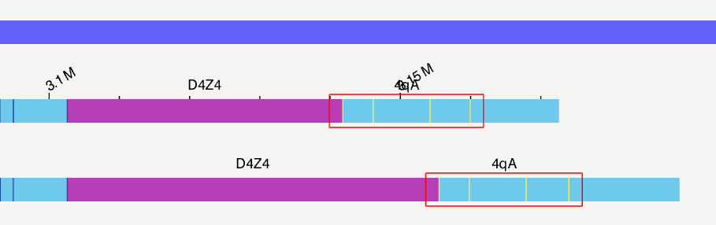
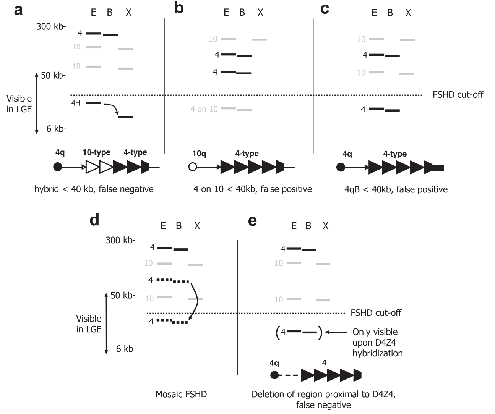

1. Genome Browser에서 repeat count * 3.3kb != 그림
   
   
   위 7 (23.1), 아래11 (36.3)
   1. Map to reference SV 로 들어갔을 때 해석방법?
2. D4Z4 hybrid / 4 on 10 / 10 on 4 detection 여부
   
   1. Circos plot?
   2. 구별 가능한지?
      1. 4-type와 10-type의 D4Z4 repeat을 구별할 수 있나?
3. 메틸화상태에 따른 labeling 차이 여부
4. RASTful API open?

